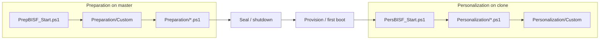

# AGENTS.md

**BIS-F (Base Image Script Framework)** seals Windows golden images and personalizes clones
for non-persistent VDI (Citrix PVS/MCS, Omnissa Horizon, AVD, Sysprep). Target runtime is
**Windows PowerShell 5.1**. License: GPL-3.0.

This file is the committed instruction source for coding agents. Cursor-only paths
(`.cursor/`, `CLAUDE.md`) are gitignored. Human setup lives in
[README.md](README.md) and [CONTRIBUTING.md](CONTRIBUTING.md).

## Contents

- [How it runs](#how-it-runs)
- [Layout](#layout)
- [Commands](#commands)
- [PowerShell](#powershell)
- [Boundaries](#boundaries)
- [Git](#git)
- [Docs](#docs)

## How it runs

`Invoke-BISFFolderScripts` loads `*.ps1` in **name order** (no recurse). Number prefixes
are the run order (`00_` … `99_`). Prep Custom runs **before** shipped prep scripts;
pers Custom runs **after** shipped pers scripts.

> [!IMPORTANT]
> Prefer ADMX over leftover CLI switches. Policy values land in
> `HKLM:\SOFTWARE\Policies\Login Consultants\BISF` as `$LIC_BISF_*`.
> Install metadata is `HKLM:\SOFTWARE\Login Consultants\BISF` (`Path`, `Version`).

## Layout

| Path | Role |
| :--- | :--- |
| `Framework/PrepBISF_Start.ps1` | Preparation entry (`PrepareBaseImage.cmd`) |
| `Framework/PersBISF_Start.ps1` | Personalization entry (scheduled task / first boot) |
| `Framework/SubCall/Global/` | Shared module (`BISF.psm1` / `BISF.psd1`) |
| `Framework/SubCall/Preparation/` | Seal scripts (`NN_PrepBISF_*.ps1`) |
| `Framework/SubCall/Personalization/` | First-boot scripts (`NN_PersBISF_*.ps1`) |
| `Framework/SubCall/Template/BISF_TEMPLATE.ps1` | Start here for new prep/pers scripts |
| `ADMX/` | Group Policy templates (`EUCweb.Policies.BISF`) |
| `tools/` | Installer and CI helpers |

Product version is `YYMM.minor` in `BISF.psd1` (`ModuleVersion`); current is `2608.0`.
Default branch on this fork: **`refactor/modernize`**.

## Commands

Run from the repo root on Windows. Install PSScriptAnalyzer once:
`Install-Module PSScriptAnalyzer -Scope CurrentUser`.

| Check | Command |
| :--- | :--- |
| Analyzer (CI Error severity) | `.\tools\Invoke-BISFScriptAnalyzer.ps1 -Severity Error` |
| Variable PascalCase | `.\tools\Test-BISFVariableCasing.ps1` |
| Casing ratchet (PR-style) | `.\tools\Test-BISFVariableCasing.ps1 -ChangedOnly` |
| UTF-8 BOM | `.\tools\Test-BISFUtf8Bom.ps1` |
| Add missing BOM | `.\tools\Test-BISFUtf8Bom.ps1 -Fix` |
| Splash DLL LoadFrom vs files | `.\tools\Test-BISFSplashAssemblies.ps1` |
| Markdown | `markdownlint-cli2 --fix "**/*.md"` |
| Whitespace | `git diff --check` |

CI: `validate-scripts.yml` (analyzer Error, casing, BOM, splash assemblies), `markdownlint.yml`,
`codeql-powershell.yml`. Pins live in `.github/tool-versions.env`.

## PowerShell

Generate **Windows PowerShell 5.1**, not Bash. Analyzer target is 5.1
(`.vscode/PSScriptAnalyzerSettings.psd1`).

- Encoding: **UTF-8 with BOM** for `*.ps1` / `*.psm1` / `*.psd1`. EOL: **CRLF**.
- Variables and parameters: **PascalCase** (`$LogPath`). Scope: `$Global:`, `$Script:`,
  `$Env:`. Automatics keep Microsoft spelling (`$PSScriptRoot`, `$PSBoundParameters`).
- No new underscore names (`$MainFolder`, not `$Main_Folder`).
- Approved verbs for new exported functions. No aliases in shipped code
  (`Get-ChildItem`, not `ls`). Chain with newlines or `;`, not `&&`.
- Prep/pers scripts are **dot-sourced after** the module loads. Do **not**
  `Import-Module` there. Log with `Write-BISFLog`; gate on install with
  `Test-BISFService`; stop/start with `Invoke-BISFService`.
- New scripts: copy the template. Names:
  `NN_PrepBISF_{Name}.ps1` / `NN_PersBISF_{Name}.ps1`.
- Header `.NOTES` History: `dd.mm.yyyy XX: …`. Do not add `.LINK https://eucweb.com`
  (module `HelpInfoURI` in `BISF.psd1` is the project URL).
- Reuse helpers in `BISF.psm1`. Do not invent a parallel logger or service wrapper.

> [!WARNING]
> `BISF.psd1` sets `DefaultCommandPrefix = 'BISF'`. Define/export functions
> **without** the prefix (`function Write-Log`, `FunctionsToExport = 'Write-Log'`).
> Callers use `Write-BISFLog`. Add new exports to `FunctionsToExport` explicitly.

Leave these identifiers as-is (casing checker allowlists them): `$LIC_BISF_*`,
`$CHK_*`, `$DST_*`, legacy path globals (`$Main_Folder`, `$SubCall_Folder`,
`$LIB_Folder`), public `Get-BISF*` / `Write-BISFLog` names.

Analyzer exclusions in settings are intentional (globals, `Invoke-Expression` for
ADMX command strings, WMI pagefile paths, `-WhatIf` on helpers). Do not "fix"
those by rewriting Framework behavior.

## Boundaries

| Do | Do not |
| :--- | :--- |
| Extend via `Custom/` or a new numbered script from the template | Rename public functions or ADMX-backed names without a migration plan |
| Gate vendor work on "is this product installed?" | Hardcode secrets, tokens, or connection strings |
| Keep prep/pers paired when a product needs both seal and first-boot | Save PowerShell as UTF-8 without BOM |
| Update ADMX/ADML together when adding a policy | Add Chocolatey/MSI packaging unless asked (winget is planned, not present) |
| Smallest diff that matches sibling scripts | Drive-by refactors, new dependencies, or NinjaOne/`scripts/automation` patterns from other repos |

Prep typically **stops services and clears machine IDs**. Pers typically **creates
host IDs and starts services**. Do not run destructive seal steps on a clone.

## Git

- Default branch: `refactor/modernize`. Use a topic branch; do not commit to the
  default branch unless the user explicitly asks.
- Commit **only** when asked. Stage only the paths for the change. No amend,
  force-push, or `--no-verify` unless requested. No agent attribution footers.
- Conventional Commits: `type(scope): lowercase subject` (no trailing period, ≤72
  chars). Types: `feat`, `fix`, `perf`, `docs`, `style`, `refactor`, `test`,
  `chore`, `build`, `ci`, `revert`. Body bullets when the change is not trivial.
- Scan staged diffs for secrets before committing.

## Docs

- US English. One `#` title; no skipped heading levels. Fences need a language tag.
- Behavior or public-doc changes: add `[Unreleased]` in [CHANGELOG.md](CHANGELOG.md)
  (Keep a Changelog). Bump `BISF.psd1` / ADMX `revision` only as part of a release.
- `LICENSE` is verbatim GPLv3 — do not lint or reformat it.
- Markdownlint: `.markdownlint.json` + `.markdownlint-cli2.jsonc` (`LICENSE` ignored).
- Heading emojis are for human README sections, not this file.
