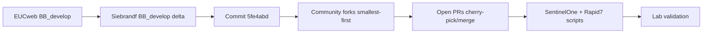

# BIS-F fork merge and security-agent plan

> Saved plan for later review. Consolidate upstream and community BIS-F changes into a private fork, merge applicable open PRs, and add or update SentinelOne and Rapid7 Insight Agent sealing for Citrix/VDI golden images.

## Decisions locked in

- Base branch: `BB_develop` (EUCweb convention for current BIS-F development).
- Working branch: `2608` — create this branch from the baseline **before** committing merge or agent changes; all consolidation work lands on `2608`, then open a PR back to `BB_develop` / fork default.
- Merge strategy: surgical cherry-picks and targeted merges; avoid blind full-fork merges that break sealing scripts.
- Target: Windows golden images for Citrix MCS/PVS and general VDI (PowerShell 5.1, BIS-F phase script conventions).
- SentinelOne: install on master, wait for full on-image disk scan, reset identity before shutdown (modern `VDI_MASTER=1` or legacy `sentinelctl`).
- Rapid7: follow [Rapid7 virtualization guidance](https://docs.rapid7.com/insight-agent/virtualization/) (stop service, remove `bootstrap.cfg` before seal); no Citrix-specific duplicate-ID KB—console-side InsightVM VDI correlation is optional and separate from sealing.

## Source repositories

| Source | URL | Role |
| --- | --- | --- |
| Upstream | [EUCweb/BIS-F](https://github.com/EUCweb/BIS-F) | Official baseline |
| Upstream commit | [5fe4abd](https://github.com/EUCweb/BIS-F/commit/5fe4abdf6cde9aeca87cfa51cab830373a9c5a45) | Named commit to include |
| Siebrandf delta | [BB_develop compare](https://github.com/EUCweb/BIS-F/compare/BB_develop...Siebrandf:BIS-F:BB_develop) | Community branch delta vs upstream |
| DennisHirsch26 | [DennisHirsch26/BIS-F](https://github.com/DennisHirsch26/BIS-F) | Community fork; review open PRs |
| Pascal PDQ | [BIS-F-PDQ-Fixes](https://github.com/Pascal-Smit-OGD/BIS-F-PDQ-Fixes) | PDQ-related fixes |
| Deyda | [Deyda/BIS-F](https://github.com/Deyda/BIS-F) | Community fork; review open PRs |
| micswe | [micswe/BIS-F](https://github.com/micswe/BIS-F) | Community fork; review open PRs |
| Your fork | `INSERT YOUR FORK URL` | Working repo and default branch |

## Merge order



1. **EUCweb `BB_develop`** — establish clean baseline in your fork.
2. **Siebrandf `BB_develop` compare** — port commits not already in upstream; resolve conflicts early.
3. **Commit `5fe4abd`** — cherry-pick if not already contained in merged history.
4. **Community forks** (suggested order: Pascal PDQ fixes → DennisHirsch26 → Deyda → micswe) — one remote at a time; document skip/merge per commit.
5. **Open PRs** — on EUCweb and each fork; merge or defer with one-line rationale.

## Phase 1 — Inventory and remotes

- [ ] Clone your fork; add remotes: `eucweb`, `siebrandf`, `dennishirsch`, `pascal-pdq`, `deyda`, `micswe`.
- [ ] Fetch all remotes; list branches (`BB_develop`, `master`/`main`).
- [ ] Build merge matrix (spreadsheet or markdown table):

| Source | Commit / PR | Files touched | Overlap with prior merges | Action | Status |
| --- | --- | --- | --- | --- | --- |
| Siebrandf | … | … | … | cherry-pick / skip | pending |

- [ ] List open PRs on each repo (GitHub `gh pr list --repo OWNER/REPO --state open` or web UI).
- [ ] Map existing BIS-F security-agent scripts (SentinelOne, CrowdStrike, etc.) under `Framework/` or equivalent paths in upstream layout.

### Remote setup (example)

```powershell
git remote add eucweb https://github.com/EUCweb/BIS-F.git
git remote add siebrandf https://github.com/Siebrandf/BIS-F.git
git remote add dennishirsch https://github.com/DennisHirsch26/BIS-F.git
git remote add pascal-pdq https://github.com/Pascal-Smit-OGD/BIS-F-PDQ-Fixes.git
git remote add deyda https://github.com/Deyda/BIS-F.git
git remote add micswe https://github.com/micswe/BIS-F.git
git fetch --all
```

## Phase 2 — Merge and conflict resolution

- [ ] **Create and switch to working branch `2608` from your fork’s `BB_develop` before any merge or script commits** (`git checkout -b 2608 BB_develop`). Do not commit consolidation work on `BB_develop` / `develop` / `main`.
- [ ] Merge or cherry-pick Siebrandf delta: prefer `git log eucweb/BB_develop..siebrandf/BB_develop --oneline` then cherry-pick by topic.
- [ ] Cherry-pick `5fe4abd` if absent: `git cherry-pick 5fe4abdf6cde9aeca87cfa51cab830373a9c5a45`.
- [ ] For each community fork: compare against current HEAD; cherry-pick sealing, PDQ, or agent-related commits only.
- [ ] For each open PR: checkout PR branch locally (`gh pr checkout N`), rebase onto working branch, merge if clean and on-scope.
- [ ] Resolve conflicts preserving BIS-F patterns: numbered phases, `Start.ps1`/`Stop.ps1`, logging (`Write-BISFLog` or repo equivalent).
- [ ] Group commits: one merge/cherry-pick series per source; separate commit(s) for new SentinelOne/Rapid7 work.

### PR merge rules

- **Merge** when: touches sealing, agents, PDQ, or BB_develop fixes; no conflict with already-merged logic; tests or peer review on source PR.
- **Defer** when: duplicate of merged change, breaks BB_develop, or out of scope (document reason in merge matrix).
- **Manual port** when: PR is stale but diff is still wanted—apply hunks by hand rather than merging whole branch.

## Phase 3 — SentinelOne (latest agent + VDI)

### Requirements (vendor / partner KB)

- Install SentinelOne on the **master image**; allow full registration with management.
- **Wait for on-image full disk scan to complete** before sealing. Cloning while a scan runs causes bad clones.
- Reset identity before shutdown:
  - **Modern (cold clone):** `VDI_MASTER=1` at MSI install (Ansible `s1_enable_vdi: true` maps to this flag).
  - **Legacy / edge (approx. 3.1–3.3.2 or when VDI flag unavailable):** from agent folder run `sentinelctl.exe agent_id -r -b -k`, then verify with `sentinelctl.exe agent_id -v`.

### Implementation tasks

- [ ] Locate or create BIS-F script(s) in the correct finalize/sealing phase folder.
- [ ] **Install path (if scripted):** support `msiexec /i "SentinelAgent*.msi" VDI_MASTER=1` (and site token params per your deployment).
- [ ] **Version detection:** branch logic for VDI_MASTER-supported vs legacy `sentinelctl` reset.
- [ ] **Scan wait:** poll scan status with timeout and logging (console API, agent status, or documented CLI—match what your tenant supports); fail sealing with clear message if scan incomplete.
- [ ] **Pre-shutdown reset:** run appropriate identity reset; verify with `agent_id -v`.
- [ ] Document operator prerequisites: site token, optional anti-tamper passphrase, minimum agent version.

### SentinelOne flow (operator view)

1. Install agent on golden image (with `VDI_MASTER=1` when supported).
2. Confirm agent registered and healthy in console.
3. Wait until full disk scan completes on the master image.
4. Run BIS-F sealing script: identity reset (if not already handled by VDI install) + verify.
5. Shut down master; do not clone during active scan.

## Phase 4 — Rapid7 Insight Agent

### Requirements (Rapid7 virtualization — not Citrix-specific)

Citrix does not publish a separate Rapid7 duplicate-ID procedure. Use [Virtualization | Rapid7 Agent](https://docs.rapid7.com/insight-agent/virtualization/):

- Install Insight Agent on golden image; **do not leave the agent in a state that clones duplicate identity**.
- Stop the `ir_agent` service before sealing (Windows service starts automatically after install).
- **Remove** `bootstrap.cfg` before capture:

  `C:\Program Files\Rapid7\Insight Agent\components\bootstrap\common\bootstrap.cfg`

- Each clone generates its own Agent ID on first startup after seal.

**Optional (console, not BIS-F):** [InsightVM non-persistent VDI correlation](https://docs.rapid7.com/insightvm/non-persistent-vdi-correlation/) via custom UUID—use when you want many VDIs correlated as one asset; different goal from per-clone unique IDs.

### Implementation tasks

- [ ] Add BIS-F sealing script(s): stop `ir_agent`, delete `bootstrap.cfg`, verify file absent.
- [ ] Idempotent checks: skip or no-op if agent not installed.
- [ ] Match naming and phase placement of peer security scripts (e.g. SentinelOne).
- [ ] Log paths and service state before/after for troubleshooting.
- [ ] README comment block: expected clone behavior; pointer to InsightVM correlation doc if ops team uses it.

### Rapid7 flow (operator view)

1. Install Rapid7 Insight Agent on golden image.
2. Stop `ir_agent` service.
3. Delete `bootstrap.cfg` at the path above.
4. Verify file removed; proceed with BIS-F finalize/shutdown.
5. On first boot of cloned VM, agent starts and registers with a new ID.

## Phase 5 — Validation

### Static checks

- [ ] PowerShell 5.1 compatible syntax.
- [ ] Paths with spaces quoted (`Program Files`, `Rapid7\Insight Agent`).
- [ ] Admin elevation assumptions documented.
- [ ] No secrets in repo (tokens, site keys, passphrases as placeholders only).

### Lab checklist (golden image)

- [ ] Run full BIS-F sequence on a test VM with SentinelOne + Rapid7 installed.
- [ ] Confirm SentinelOne: scan completed before seal; master shows reset/VDI-ready state per version.
- [ ] Clone VM (MCS or manual snapshot); boot clone.
- [ ] Confirm SentinelOne clone: unique agent identity; healthy in console.
- [ ] Confirm Rapid7 clone: new Agent ID; `bootstrap.cfg` recreated on first start.
- [ ] Re-run sealing scripts on master (idempotency smoke test) if applicable.

## Primary deliverables

| Deliverable | Location / form |
| --- | --- |
| Updated fork | Your GitHub fork, branch `2608` → PR to your default (`BB_develop` / `develop`) |
| Merge matrix | Section in this doc or `docs/wiki/how-to/bisf-merge-matrix.md` |
| SentinelOne script(s) | BIS-F phase folder in fork |
| Rapid7 script(s) | BIS-F phase folder in fork |
| CHANGELOG | Fork root or release notes summarizing merged sources and new scripts |
| Operator notes | Inline in scripts + short appendix in this doc if needed |

## Quality checklist (sign-off)

- [ ] Branch `2608` created from baseline before merge/agent commits; no consolidation commits on default branch
- [ ] All listed remotes fetched; merge matrix complete
- [ ] Commit `5fe4abd` and Siebrandf delta incorporated or explicitly skipped
- [ ] All applicable open PRs merged or deferred with reason
- [ ] SentinelOne: VDI_MASTER + legacy `sentinelctl` paths handled
- [ ] SentinelOne: full-disk scan wait with timeout/logging
- [ ] Rapid7: service stopped and `bootstrap.cfg` removed before seal
- [ ] Scripts follow BIS-F phase conventions
- [ ] Lab validation checklist executed on at least one clone test
- [ ] No unresolved merge conflicts in tree

## Open considerations

- **Agent versions:** Pin minimum SentinelOne and Rapid7 versions in script comments when behavior differs (VDI flag availability, scan status API).
- **Anti-tamper:** SentinelOne `sentinelctl` reset may require passphrase when tamper protection is on—document retrieval from console (Actions → Show Passphrase).
- **Rapid7 billing / asset count:** Non-persistent VDIs may still appear as separate agents in some products; correlation is a console configuration topic, not solved by sealing alone.
- **PDQ fixes fork:** Pascal-Smit-OGD repo may use different folder layout—verify paths before cherry-pick.
- **Upstream PRs:** Prefer contributing generic fixes back to EUCweb after fork stabilizes, to shrink long-term merge debt.

## Related references

- [EUCweb/BIS-F](https://github.com/EUCweb/BIS-F)
- [Sentinel-One ansible_collection_s1agents — s1_enable_vdi](https://github.com/Sentinel-One/ansible_collection_s1agents/blob/main/roles/s1_agent_install/README.md)
- [Rapid7 Agent virtualization](https://docs.rapid7.com/insight-agent/virtualization/)
- [Rapid7 Agent controls (bootstrap.cfg / UUID)](https://docs.rapid7.com/insight-agent/agent-controls/)
- [Citrix CTX236683 — duplicate SCCM GUIDs with MCS](https://support.citrix.com/external/article/CTX236683/virtual-machines-created-with-mcs-might.html) (pattern reference for “seal before clone” discipline; separate from Rapid7)
