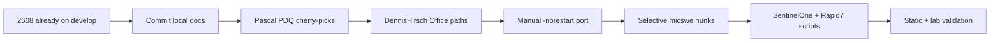

# BIS-F fork merge and security-agent plan

> Consolidate upstream and community BIS-F changes into a private fork, merge applicable open PRs, and add or update SentinelOne and Rapid7 Insight Agent sealing for Citrix/VDI golden images.

## Decisions locked in

- Base branch: **`develop`** (EUCweb active line). `BB_develop` is historical (frozen ~2019) — do not rebase onto it.
- Working branch: **`2608`** — already created from upstream `develop`. All consolidation work lands here, then PR back to fork `develop`.
- Merge strategy: surgical cherry-picks and targeted merges; avoid blind full-fork merges that break sealing scripts.
- Target: Windows golden images for Citrix MCS/PVS and general VDI (PowerShell 5.1, BIS-F phase script conventions).
- SentinelOne: install on master, wait for full on-image disk scan, reset identity before shutdown (modern `VDI_MASTER=1` or legacy `sentinelctl`).
- Rapid7: follow [Rapid7 virtualization guidance](https://docs.rapid7.com/insight-agent/virtualization/) (stop service, remove `bootstrap.cfg` before seal); no Citrix-specific duplicate-ID KB—console-side InsightVM VDI correlation is optional and separate from sealing.
- Siebrandf: **skip** — only delta was `$DisMode` → `$DiskMode`, already on `develop` (HF 177).
- Commit `5fe4abd`: **manual port** of `-norestart` on `Set-NetAdapterRSS` into `52_PrepBISF_VMWareTCPIPOptimizations.ps1` (do not cherry-pick the old SHA).

## Source repositories

| Source | URL | Role |
| --- | --- | --- |
| Upstream | [EUCweb/BIS-F](https://github.com/EUCweb/BIS-F) | Official baseline (`develop`) |
| Upstream commit | [5fe4abd](https://github.com/EUCweb/BIS-F/commit/5fe4abdf6cde9aeca87cfa51cab830373a9c5a45) | Intent only — manual `-norestart` port |
| Siebrandf | [Siebrandf/BIS-F](https://github.com/Siebrandf/BIS-F) | Skip (obsolete vs `develop`) |
| DennisHirsch26 | [DennisHirsch26/BIS-F](https://github.com/DennisHirsch26/BIS-F) | Office path detection commit |
| Pascal PDQ | [BIS-F-PDQ-Fixes](https://github.com/Pascal-Smit-OGD/BIS-F-PDQ-Fixes) | PDQ-related fixes (5 commits) |
| Deyda | [Deyda/BIS-F](https://github.com/Deyda/BIS-F) | Review; mostly merge noise — defer |
| micswe | [micswe/BIS-F](https://github.com/micswe/BIS-F) | Selective hunks only — no whole-branch merge |
| Working fork | [JonathanPitre/BIS-F](https://github.com/JonathanPitre/BIS-F) | Working repo; default `develop` |

## Merge order



1. **Keep `2608` on `develop`** — baseline already set; do not touch `BB_develop`.
2. **Pascal PDQ** — cherry-pick 5 commits one-by-one.
3. **DennisHirsch26** — cherry-pick Office 2019/2021/2024 path commit.
4. **Manual `-norestart` port** from `5fe4abd` intent.
5. **Open PRs / micswe** — selective only; defer Deyda/micswe whole-branch merges.
6. **SentinelOne + Rapid7** sealing scripts.

## Merge matrix

| Source | Commit / PR | Files touched | Overlap with prior merges | Action | Status |
| --- | --- | --- | --- | --- | --- |
| Siebrandf | DisMode→DiskMode | `00_PersBISF_WriteCacheDisk.ps1` | Already HF 177 on develop | skip | done |
| Pascal PDQ | 5 commits on develop | `BISF.psm1`, RDS grace, WriteCache, PRE/BUILD | Core prep scripts | cherry-pick | pending |
| DennisHirsch26 | Office paths | Office detection | Low | cherry-pick | pending |
| 5fe4abd | `-norestart` | `52_PrepBISF_VMWareTCPIPOptimizations.ps1` | File diverged | manual port | pending |
| Deyda | develop tip | README / merges | Noise | defer | deferred |
| micswe | selected hunks | WEM / EventLog / McAfee (review) | Noisy history | selective | pending |
| Agents | new scripts | `10_PrepBISF_*` | New files | add | pending |

## Phase 1 — Inventory and remotes

- [x] Working branch `2608` from `develop` (already done).
- [ ] Add remotes: `eucweb`, `dennishirsch`, `pascal-pdq`, `deyda`, `micswe` (siebrandf optional).
- [ ] Fetch all remotes.
- [ ] List open PRs on each repo (`gh pr list --repo OWNER/REPO --state open`).
- [x] Map security-agent scripts: none for SentinelOne/Rapid7 yet; peers under `Framework/SubCall/Preparation/10_PrepBISF_*`.

### Remote setup

```powershell
git remote add eucweb https://github.com/EUCweb/BIS-F.git
git remote add dennishirsch https://github.com/DennisHirsch26/BIS-F.git
git remote add pascal-pdq https://github.com/Pascal-Smit-OGD/BIS-F-PDQ-Fixes.git
git remote add deyda https://github.com/Deyda/BIS-F.git
git remote add micswe https://github.com/micswe/BIS-F.git
git fetch --all
```

## Phase 2 — Merge and conflict resolution

- [x] On working branch `2608` from `develop` (do not commit consolidation on default branch).
- [x] Skip Siebrandf.
- [ ] Cherry-pick Pascal PDQ commits.
- [ ] Cherry-pick DennisHirsch Office path commit.
- [ ] Manual port `-norestart` (not `git cherry-pick 5fe4abd`).
- [ ] Open PRs: merge on-scope only; defer with reason in merge matrix.
- [ ] Resolve conflicts preserving BIS-F patterns: numbered phases, logging (`Write-BISFLog`).
- [ ] Group commits: one series per source; separate commit(s) for SentinelOne/Rapid7.

### PR merge rules

- **Merge** when: touches sealing, agents, PDQ, or `develop` fixes; no conflict with already-merged logic.
- **Defer** when: duplicate of merged change, breaks `develop`, or out of scope.
- **Manual port** when: PR is stale but diff is still wanted.

## Phase 3 — SentinelOne (latest agent + VDI)

### Requirements (vendor / partner KB)

- Install SentinelOne on the **master image**; allow full registration with management.
- **Wait for on-image full disk scan to complete** before sealing. Cloning while a scan runs causes bad clones.
- Reset identity before shutdown:
  - **Modern (cold clone):** `VDI_MASTER=1` at MSI install (Ansible `s1_enable_vdi: true` maps to this flag).
  - **Legacy / edge (approx. 3.1–3.3.2 or when VDI flag unavailable):** from agent folder run `sentinelctl.exe agent_id -r -b -k`, then verify with `sentinelctl.exe agent_id -v`.

### Implementation tasks

- [ ] Create `Framework/SubCall/Preparation/10_PrepBISF_AV-SentinelOne.ps1`.
- [ ] **Install path (if scripted):** support `msiexec /i "SentinelAgent*.msi" VDI_MASTER=1` (site token params per deployment — placeholders only).
- [ ] **Version detection:** branch logic for VDI_MASTER-supported vs legacy `sentinelctl` reset.
- [ ] **Scan wait:** poll scan status with timeout and logging; fail sealing with clear message if scan incomplete.
- [ ] **Pre-shutdown reset:** run appropriate identity reset; verify with `agent_id -v`.
- [ ] Document operator prerequisites: site token, optional anti-tamper passphrase, minimum agent version.

### SentinelOne flow (operator view)

1. Install agent on golden image (with `VDI_MASTER=1` when supported).
2. Confirm agent registered and healthy in console.
3. Wait until full disk scan completes on the master image.
4. Run BIS-F sealing script: identity reset (if not already handled by VDI install) + verify.
5. Shut down master; do not clone during active scan.

## Phase 4 — Rapid7 Insight Agent

### Requirements (Rapid7 virtualization — not Citrix-specific)

Citrix does not publish a separate Rapid7 duplicate-ID procedure. Use [Virtualization | Rapid7 Agent](https://docs.rapid7.com/insight-agent/virtualization/):

- Install Insight Agent on golden image; **do not leave the agent in a state that clones duplicate identity**.
- Stop the `ir_agent` service before sealing (Windows service starts automatically after install).
- **Remove** `bootstrap.cfg` before capture:

  `C:\Program Files\Rapid7\Insight Agent\components\bootstrap\common\bootstrap.cfg`

- Each clone generates its own Agent ID on first startup after seal.

**Optional (console, not BIS-F):** [InsightVM non-persistent VDI correlation](https://docs.rapid7.com/insightvm/non-persistent-vdi-correlation/) via custom UUID—use when you want many VDIs correlated as one asset; different goal from per-clone unique IDs.

### Implementation tasks

- [ ] Add `Framework/SubCall/Preparation/10_PrepBISF_Rapid7.ps1`: stop `ir_agent`, delete `bootstrap.cfg`, verify file absent.
- [ ] Idempotent checks: skip or no-op if agent not installed.
- [ ] Match naming and phase placement of peer security scripts.
- [ ] Log paths and service state before/after for troubleshooting.
- [ ] Comment block: expected clone behavior; pointer to InsightVM correlation doc if ops team uses it.

### Rapid7 flow (operator view)

1. Install Rapid7 Insight Agent on golden image.
2. Stop `ir_agent` service.
3. Delete `bootstrap.cfg` at the path above.
4. Verify file removed; proceed with BIS-F finalize/shutdown.
5. On first boot of cloned VM, agent starts and registers with a new ID.

## Phase 5 — Validation

### Static checks

- [ ] PowerShell 5.1 compatible syntax.
- [ ] Paths with spaces quoted (`Program Files`, `Rapid7\Insight Agent`).
- [ ] Admin elevation assumptions documented.
- [ ] No secrets in repo (tokens, site keys, passphrases as placeholders only).

### Lab checklist (golden image)

- [ ] Run full BIS-F sequence on a test VM with SentinelOne + Rapid7 installed.
- [ ] Confirm SentinelOne: scan completed before seal; master shows reset/VDI-ready state per version.
- [ ] Clone VM (MCS or manual snapshot); boot clone.
- [ ] Confirm SentinelOne clone: unique agent identity; healthy in console.
- [ ] Confirm Rapid7 clone: new Agent ID; `bootstrap.cfg` recreated on first start.
- [ ] Re-run sealing scripts on master (idempotency smoke test) if applicable.

## Primary deliverables

| Deliverable | Location / form |
| --- | --- |
| Updated fork | [JonathanPitre/BIS-F](https://github.com/JonathanPitre/BIS-F), branch `2608` → PR to `develop` |
| Merge matrix | This doc (section above) |
| SentinelOne script(s) | `Framework/SubCall/Preparation/10_PrepBISF_AV-SentinelOne.ps1` |
| Rapid7 script(s) | `Framework/SubCall/Preparation/10_PrepBISF_Rapid7.ps1` |
| CHANGELOG | Fork root summarizing merged sources and new scripts |
| Operator notes | Inline in scripts |

## Quality checklist (sign-off)

- [x] Branch `2608` created from `develop` before merge/agent commits
- [ ] All listed remotes fetched; merge matrix complete
- [ ] `5fe4abd` intent ported (or skip documented); Siebrandf explicitly skipped
- [ ] All applicable open PRs merged or deferred with reason
- [ ] SentinelOne: VDI_MASTER + legacy `sentinelctl` paths handled
- [ ] SentinelOne: full-disk scan wait with timeout/logging
- [ ] Rapid7: service stopped and `bootstrap.cfg` removed before seal
- [ ] Scripts follow BIS-F phase conventions
- [ ] Lab validation checklist executed on at least one clone test
- [ ] No unresolved merge conflicts in tree

## Open considerations

- **Agent versions:** Pin minimum SentinelOne and Rapid7 versions in script comments when behavior differs (VDI flag availability, scan status API).
- **Anti-tamper:** SentinelOne `sentinelctl` reset may require passphrase when tamper protection is on—document retrieval from console (Actions → Show Passphrase).
- **Rapid7 billing / asset count:** Non-persistent VDIs may still appear as separate agents in some products; correlation is a console configuration topic, not solved by sealing alone.
- **Upstream PRs:** Prefer contributing generic fixes back to EUCweb after fork stabilizes, to shrink long-term merge debt.

## Related references

- [EUCweb/BIS-F](https://github.com/EUCweb/BIS-F)
- [Sentinel-One ansible_collection_s1agents — s1_enable_vdi](https://github.com/Sentinel-One/ansible_collection_s1agents/blob/main/roles/s1_agent_install/README.md)
- [Rapid7 Agent virtualization](https://docs.rapid7.com/insight-agent/virtualization/)
- [Rapid7 Agent controls (bootstrap.cfg / UUID)](https://docs.rapid7.com/insight-agent/agent-controls/)
- [Citrix CTX236683 — duplicate SCCM GUIDs with MCS](https://support.citrix.com/external/article/CTX236683/virtual-machines-created-with-mcs-might.html) (pattern reference for “seal before clone” discipline; separate from Rapid7)
